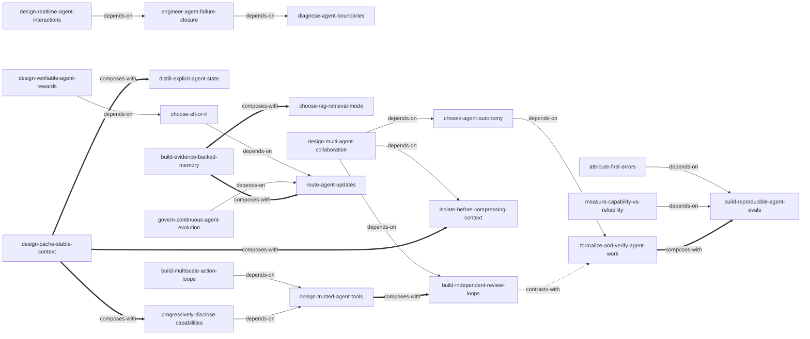

# 《深入理解 AI Agent：设计原理与工程实践》— Skill 索引

> 本书由 cangjie-skill 蒸馏，共产出 **22** 个可独立调用的 Skills。处理日期：2026-08-12。

## 关于本书

- **作者**：李博杰
- **版本**：2026 年，v1.4
- **一句话主旨**：以 `Agent = LLM + 上下文 + 工具` 为统一模型，通过 Harness、评估和可验证的持续进化，把模型能力转化为能在真实环境中可靠完成任务的 Agent 系统。
- **整书理解**：[BOOK_OVERVIEW.md](./BOOK_OVERVIEW.md)
- **精华长文**：[DIGEST.md](./DIGEST.md)
- **术语词典**：[GLOSSARY.md](./GLOSSARY.md)

---

## Skill 列表

### 架构、上下文与知识

- [`diagnose-agent-boundaries`](../../skills/ai-agent/foundations/diagnose-agent-boundaries/SKILL.md) — 按观察、策略、动作、反馈定位现有 Agent 的首个边界断点。
- [`choose-agent-autonomy`](../../skills/ai-agent/foundations/choose-agent-autonomy/SKILL.md) — 按路径动态性、验证能力和副作用风险选择单调用、工作流或局部自治。
- [`design-cache-stable-context`](../../skills/ai-agent/context-knowledge/design-cache-stable-context/SKILL.md) — 以稳定前缀和动态后缀提高缓存命中并降低长会话成本。
- [`progressively-disclose-capabilities`](../../skills/ai-agent/context-knowledge/progressively-disclose-capabilities/SKILL.md) — 让能力目录常驻、核心流程命中加载、细则按缺口读取。
- [`distill-explicit-agent-state`](../../skills/ai-agent/context-knowledge/distill-explicit-agent-state/SKILL.md) — 从原始轨迹确定性归约可审计的当前状态投影。
- [`isolate-before-compressing-context`](../../skills/ai-agent/context-knowledge/isolate-before-compressing-context/SKILL.md) — 先隔离高噪声子任务，再对不可隔离内容做保真压缩。
- [`build-evidence-backed-memory`](../../skills/ai-agent/context-knowledge/build-evidence-backed-memory/SKILL.md) — 以追加证据为真源，维护可重建的长期记忆与知识视图。
- [`choose-rag-retrieval-mode`](../../skills/ai-agent/context-knowledge/choose-rag-retrieval-mode/SKILL.md) — 按问题几何选择固定检索、迭代探索或全库聚合。

### 工具、执行与验证边界

- [`design-trusted-agent-tools`](../../skills/ai-agent/tools-runtime/design-trusted-agent-tools/SKILL.md) — 以结构化契约、最小权限和服务端真值建立可信工具边界。
- [`build-independent-review-loops`](../../skills/ai-agent/tools-runtime/build-independent-review-loops/SKILL.md) — 用异源证据把提议、审核、退回和发布组成闭环。
- [`engineer-agent-failure-closure`](../../skills/ai-agent/tools-runtime/engineer-agent-failure-closure/SKILL.md) — 将检测、有限恢复、幂等和终止出口工程化为故障状态机。
- [`formalize-and-verify-agent-work`](../../skills/ai-agent/tools-runtime/formalize-and-verify-agent-work/SKILL.md) — 把自然语言语义转成代码、约束或工作流，并以外部结果验收。

### 评估与失败归因

- [`measure-capability-vs-reliability`](../../skills/ai-agent/evaluation/measure-capability-vs-reliability/SKILL.md) — 分开测量多次尝试的能力上限与连续成功的生产可靠性。
- [`build-reproducible-agent-evals`](../../skills/ai-agent/evaluation/build-reproducible-agent-evals/SKILL.md) — 建设可重置环境中的结果、过程和质量三层评估系统。
- [`attribute-first-errors`](../../skills/ai-agent/evaluation/attribute-first-errors/SKILL.md) — 沿可重放轨迹定位首个因果错误，并用单变量配对回归验证修复。

### 训练、更新与持续进化

- [`choose-sft-or-rl`](../../skills/ai-agent/training-evolution/choose-sft-or-rl/SKILL.md) — 先排除外部可逆修复，再以 SFT 固形、RL 塑策。
- [`design-verifiable-agent-rewards`](../../skills/ai-agent/training-evolution/design-verifiable-agent-rewards/SKILL.md) — 以可验证结果为基线，联合门控过程信号与违规路径。
- [`route-agent-updates`](../../skills/ai-agent/training-evolution/route-agent-updates/SKILL.md) — 将经验路由到知识、指令、程序或参数的自然载体。
- [`govern-continuous-agent-evolution`](../../skills/ai-agent/training-evolution/govern-continuous-agent-evolution/SKILL.md) — 用在线执行、离线候选、可信根、canary 和回滚治理持续进化。

### 实时交互、行动与协作

- [`design-realtime-agent-interactions`](../../skills/ai-agent/interaction-collaboration/design-realtime-agent-interactions/SKILL.md) — 为流式多模态、barge-in 和 partial/final 结果划定消费与提交边界。
- [`build-multiscale-action-loops`](../../skills/ai-agent/interaction-collaboration/build-multiscale-action-loops/SKILL.md) — 在目标、规划、技能和控制层之间建立多时间尺度闭环。
- [`design-multi-agent-collaboration`](../../skills/ai-agent/interaction-collaboration/design-multi-agent-collaboration/SKILL.md) — 先证明信息增量，再设计多 Agent 拓扑、移交、预算和生命周期。

---

## 主要关系图



图例：`-->` 表示前一 Skill `depends-on` 后一 Skill；`==>` 表示 `composes-with`；`-.->` 表示 `contrasts-with`。组合和对比是双向语义，图中只画一次；完整关系以各 `SKILL.md` 的 `related_skills` 为准。

---

## 推荐学习顺序

1. **系统边界**：先读 `diagnose-agent-boundaries`、`design-trusted-agent-tools`、`isolate-before-compressing-context` 和 `formalize-and-verify-agent-work`，再读 `choose-agent-autonomy`，建立观察/动作、权限、上下文、确定性验收与自治分配的基础。
2. **上下文与知识**：再读 `design-cache-stable-context`、`distill-explicit-agent-state`、`progressively-disclose-capabilities`、`build-evidence-backed-memory` 和 `choose-rag-retrieval-mode`，区分布局、状态、能力加载、写路径与读路径。
3. **运行时与评估**：学习 `engineer-agent-failure-closure`、`build-reproducible-agent-evals`、`build-independent-review-loops` 和 `build-multiscale-action-loops`，先具备恢复、验证与外部真值，再扩展行动闭环。
4. **指标与归因**：在可复现评估之上学习 `measure-capability-vs-reliability` 和 `attribute-first-errors`，分别回答系统是否稳定、单个失败为何发生。
5. **交互与协作**：有了自治、隔离、审核和故障闭环后，再学习 `design-realtime-agent-interactions` 与 `design-multi-agent-collaboration`。
6. **更新与进化**：最后按 `route-agent-updates` → `choose-sft-or-rl` → `design-verifiable-agent-rewards` → `govern-continuous-agent-evolution` 推进；每一步都以前述评估证据为硬门。

---

## 安装使用

本目录是蒸馏产物，宿主不会自动从这里加载 Skill。将需要的整个 Skill 目录复制到宿主的用户级或项目级 Skills 目录，不要只复制 `SKILL.md`：

```bash
# 在仓库根目录安装全部 Skills 到 Codex 用户级目录
./scripts/install.sh --target ~/.codex/skills

# 只安装一个 Skill，或改用 Claude/Cursor 目标目录
./scripts/install.sh --target ~/.claude/skills --skill diagnose-agent-boundaries
```

安装后用该 Skill 的中英文 trigger 进行一次命中测试，并用“不适用”示例确认不会误触发。批量安装前先检查目标目录中是否已有同名 Skill，避免静默覆盖本地版本。

---

## 审计轨迹

- **阶段 0 整书理解**：[BOOK_OVERVIEW.md](./BOOK_OVERVIEW.md)
- **阶段 1.5 三重验证结果**：[verified.md](./verified.md)
- **候选框架**：[audit/candidates/frameworks.md](./audit/candidates/frameworks.md)
- **候选原则**：[audit/candidates/principles.md](./audit/candidates/principles.md)
- **案例证据**：[audit/candidates/cases.md](./audit/candidates/cases.md)
- **反例与边界**：[audit/candidates/counter-examples.md](./audit/candidates/counter-examples.md)
- **候选术语**：[audit/candidates/glossary.md](./audit/candidates/glossary.md)
- **淘汰与合并记录**：[audit/rejected/](./audit/rejected/)
- **共享术语词典**：[GLOSSARY.md](./GLOSSARY.md)
- **精华长文**：[DIGEST.md](./DIGEST.md)
